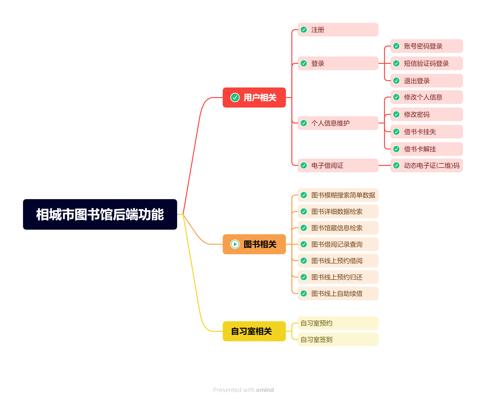

# librarySys
前端基于Vue + ElementUI
后端基于SpringBoot + MP + Redis + MySQL开发的图书馆前后端系统

### 后端已实现及将要实现的功能(TODO)

### 网站状态码及日志类型码
#### 状态码
|状态码|说明|备注|
|:-:|:-:|:-:|
|1001|||

#### 日志类型码
|类型码|说明|备注|
|:-:|:-:|:-:|
|5001|登录成功||
|5005|注册成功||